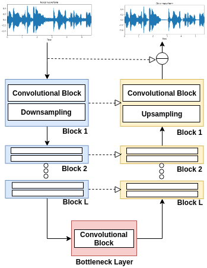
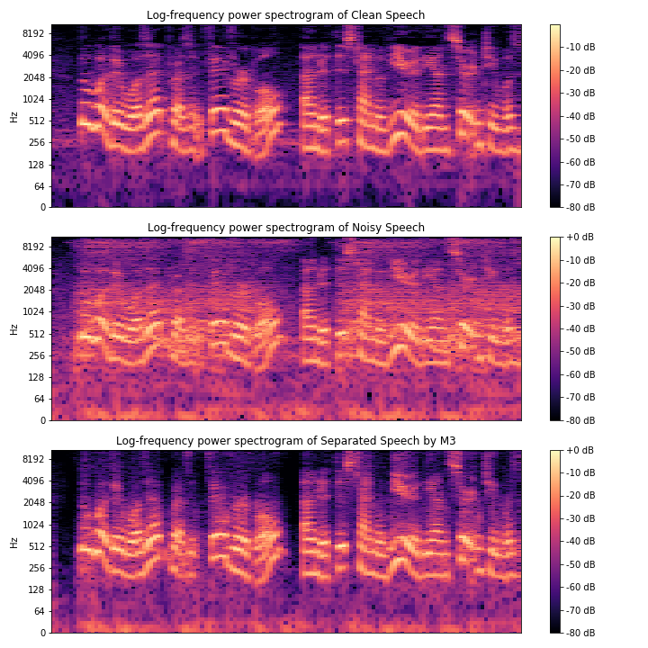

# SEWUNet

> Speech Enhancement through Deep Wave-U-Net

Check the full paper [here](https://www.sciencedirect.com/science/article/abs/pii/S0957417420304061).

<p align="center">
  
</p>

## Introduction

> In this paper we present an end-to-end approach to remove background context from speech signals on its raw waveform. The input of the network is an audio, with 16kHz of sample rate, corrupted by an additive noise within a signal-to-noise ratio between 5dB and 15dB, uniformly distributed. The system aims to produce a signal with clean speech content. Currently there are multiple deep learning architectures for this task, with encouraging results, from spectral-based frontends to raw waveform. Our method is based on the Wave-U-Net architecture with some adaptations to our problem, proposing a weight initialization through an autoencoder before initializing the training for the main task. We show that, through quantitative metrics, our method is prefered over the classical Wiener filtering.

## How to use

The are two ways of use this repository: 
	1. To train your own model with your data
	2. Only apply the the technique on your data with a pre-trained model

### How to train

tl;dr: Steps to train the best model in the same way as show in the paper.

1. Download the *LibriSpeech* dataset and the *UrbanSound8K* to your local machine.
2. Extract the files under the folder: */data/raw_data/*
3. Execute the **preprocess.py** script in the *utils* folder
4. Go to the *nbs* folder and start by executing the **autoenconder** notebook
5. Move the "*/models/checkpoint.pt*" to the *nbs* folder and rename to **ae_checkpoint.pt**
6. **(optional)** Check the results from the autoencoder in the logs folder. **Delete the files before execute the next step or both will be saved on the same directory.**
7. Execute the **model_4-L1** notebook

### Testing with trained model

tl;dr: How to test the speech enhancement with our trained model

1. Place your files under the */data/evaluate* folder.
2. Configure the **config.json** under the *src* folder.
3. Run the **test.py** script under the *src* folder.
4. Your files will be in the same directory of the input data but with a "*_processed*" suffix.


## Results

Considering a set of corrupted signals by an additive noise within SNR of 10dB, our best model could achieve 15.8dB.
Result examples can be seen on the *assets/results* folder.

<center>Spectrogram of the 00FWQOXLMACK5HE sample</center>
<p align="center">
  
</p>

## Cite
```latex
@article{GUIMARAES2020113582,
title = {Monaural speech enhancement through deep wave-U-net},
journal = {Expert Systems with Applications},
volume = {158},
pages = {113582},
year = {2020},
issn = {0957-4174},
doi = {https://doi.org/10.1016/j.eswa.2020.113582},
url = {https://www.sciencedirect.com/science/article/pii/S0957417420304061},
author = {Heitor R. Guimarães and Hitoshi Nagano and Diego W. Silva},
keywords = {Speech enhancement, Noise reduction, Wave-U-net, Deep learning, Signal to Noise Ratio (SNR), Word Error Rate (WER)},
abstract = {In this paper, we present Speech Enhancement through Wave-U-Net (SEWUNet), an end-to-end approach to reduce noise from speech signals. This background context is detrimental to several downstream systems, including automatic speech recognition (ASR) and word spotting, which in turn can negatively impact end-user applications. We show that our proposal does improve signal-to-noise ratio (SNR) and word error rate (WER) compared with existing mechanisms in the literature. In the experiments, network input is a 16 kHz sample rate audio waveform corrupted by an additive noise. Our method is based on the Wave-U-Net architecture with some adaptations to our problem. Four simple enhancements are proposed and tested with ablation studies to prove their validity. In particular, we highlight the weight initialization through an autoencoder before training for the main denoising task, which leads to a more efficient use of training time and a higher performance. Through quantitative metrics, we show that our method is prefered over the classical Wiener filtering and shows a better performance than other state-of-the-art proposals.}
}
```
